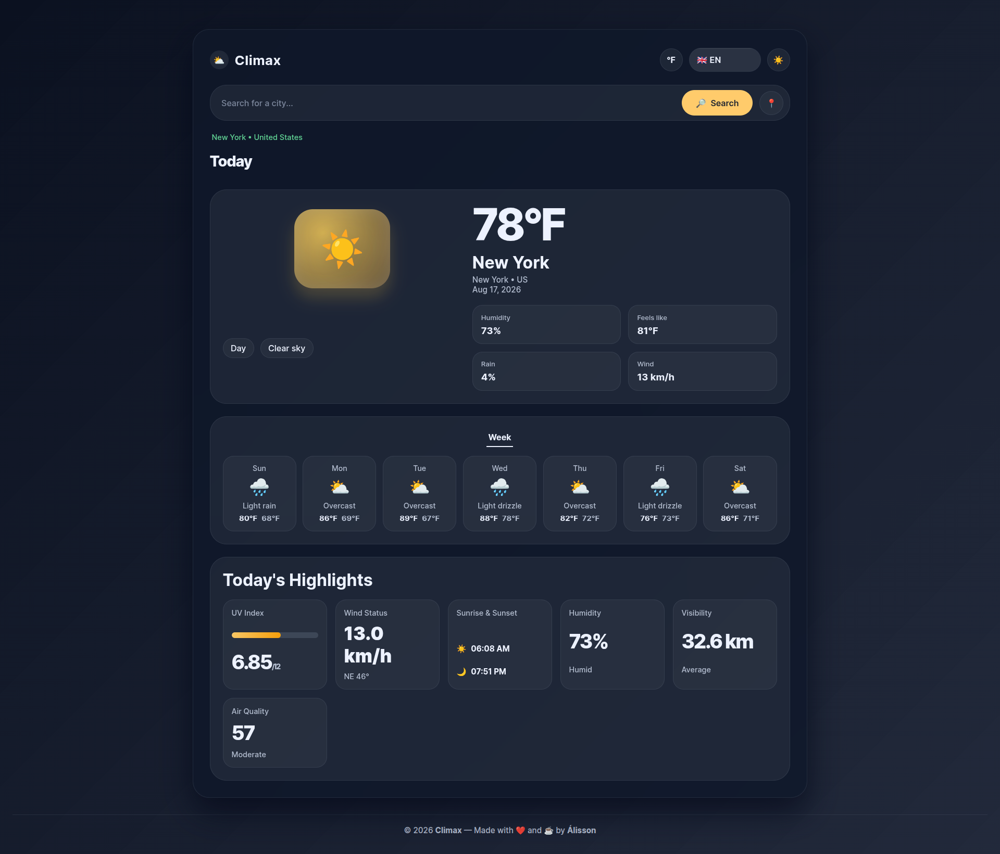
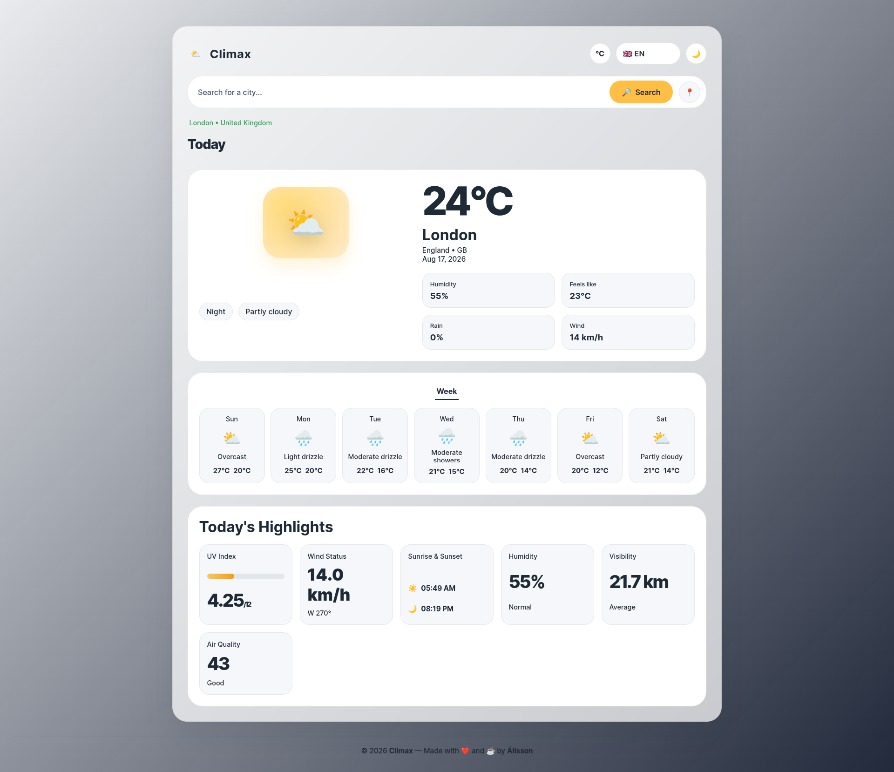

> **🇧🇷 Versão em Português** | **🇬🇧 English Version** | **🌐 Climax Web Site**
>
> _[Ir para a versão em Português](#-climax-português)_ | _[Go to the English version](#-climax-english)_ |
> [Climax Web Site](https://romaosantosalisson.github.io/climax/)
---

# 🇧🇷 Climax (Português)

## 📝 Descrição

O **Climax** é um painel climático elegante e de alta performance desenvolvido inteiramente com TypeScript puro (sem frameworks pesados) e estilizado com CSS moderno (Vanilla CSS). Ele oferece uma experiência de usuário rica, responsiva e acessível, consumindo dados meteorológicos globais em tempo real da API Open-Meteo.

### 📷 Demonstração (Imagens)

Apresentamos uma interface altamente polida e adaptável, com suporte a temas claro, escuro e sincronização com o sistema operacional:

#### Tema Escuro (Dark Mode)

<p align="center">
  
  
</p>

#### Tema Claro (Light Mode)

<p align="center">
  
  
</p>

### ✨ Funcionalidades Principais

- **Busca Global de Cidades:** Encontre informações meteorológicas de qualquer cidade do mundo com auto-completar inteligente de geolocalização.
- **Geolocalização Nativa:** Encontre o clima da sua localização atual de forma instantânea com apenas um clique usando a API do navegador.
- **Previsão para 7 Dias:** Visualização limpa e intuitiva do clima para toda a semana com temperaturas máximas, mínimas e condições ilustradas.
- **Métricas e Destaques Diários:**
  - **Índice UV:** Exibido com indicador gráfico de intensidade de 0 a 12.
  - **Status do Vento:** Velocidade (km/h) e direção precisa com bússola em graus (°).
  - **Nascer e Pôr do Sol:** Horários exatos baseados no fuso horário da cidade buscada.
  - **Umidade e Sensação Térmica:** Nível de umidade atual e temperatura sentida pelo corpo.
  - **Visibilidade:** Medição precisa da visibilidade em quilômetros.
  - **Qualidade do Ar:** Índice de qualidade do ar dos EUA (AQI) com classificações em tempo real (Bom, Moderado, Atenção, Pouco Saudável).
- **Internacionalização (i18n):** Suporte nativo completo a três idiomas: **Português (pt-BR)**, **Inglês (en-US)** e **Espanhol (es)**.
- **Temas Flexíveis:** Alternância suave entre temas **Claro (Light)**, **Escuro (Dark)** e **Sistema (System)**, adaptando os elementos gráficos e acessíveis.
- **Conversão de Unidade de Temperatura:** Alternância imediata entre Celsius (°C) e Fahrenheit (°F).
- **Acessibilidade de Ponta:** Desenvolvido seguindo boas práticas de semântica HTML e atributos ARIA para leitores de tela.

### 🛠️ Tecnologias Utilizadas

- **TypeScript:** Tipagem estática e organização robusta de código.
- **Vite:** Empacotador (bundler) ultra-rápido para desenvolvimento moderno.
- **HTML5 & CSS3:** Arquitetura semântica e estilos Vanilla CSS customizados, com variáveis CSS poderosas para suporte nativo a temas.
- **Open-Meteo API:** Integração com APIs gratuitas e de alta fidelidade para previsão do tempo, geolocalização reversa e qualidade do ar.
- **Prettier & ESLint:** Linters e formatadores pré-configurados para garantir a qualidade de código do ecossistema JavaScript.

### 📂 Estrutura do Projeto

```text
climax/
├── public/                 # Favicon e ativos estáticos públicos
├── src/
│   ├── api/
│   │   └── openMeteo.ts    # Serviços de busca e consumo das APIs Open-Meteo
│   ├── assets/
│   │   └── images/         # Capturas de tela para documentação
│   ├── components/         # Componentes modulares reutilizáveis (HTML Markup)
│   │   ├── footer.ts
│   │   ├── header.ts
│   │   └── search.ts
│   ├── types/
│   │   └── index.ts        # Interfaces e tipos de dados estáticos do TypeScript
│   ├── app.ts              # Ponto de entrada que escuta o carregamento do DOM
│   ├── i18n.ts             # Dicionário de traduções e utilitários de idioma
│   ├── main.ts             # Lógica central da aplicação (Estado, Eventos e Renderização)
│   ├── storage.ts          # Gerenciamento de persistência de Tema e Unidade no LocalStorage
│   ├── styles.css          # Estilização completa do layout com CSS Grid/Flexbox e Temas
│   └── utils.ts            # Funções utilitárias auxiliares (ex: escape de HTML)
├── package.json            # Scripts de build, dev e dependências do projeto
├── tsconfig.json           # Configurações do compilador TypeScript
└── eslint.config.mjs       # Configurações de Linting
```

### 🚀 Como Executar o Projeto

Siga as etapas abaixo para clonar e rodar o projeto localmente:

1. **Instale as dependências:**
   Certifique-se de ter o [Node.js](https://nodejs.org/) instalado em sua máquina. No terminal, execute:

   ```bash
   npm install
   ```

2. **Inicie o servidor de desenvolvimento:**

   ```bash
   npm run dev
   ```

   _O Vite abrirá uma porta local (geralmente `http://localhost:5173`). Abra o link no navegador._

3. **Construa o projeto para produção (Build):**

   ```bash
   npm run build
   ```

   _Isso gerará os arquivos compilados e otimizados na pasta `/dist`._

4. **Verifique ou corrija a formatação e linting:**
   ```bash
   # Rodar linting
   npm run lint
   # Corrigir linting automaticamente
   npm run lint:fix
   # Formatar código com Prettier
   npm run format
   ```

---

# 🇬🇧 Climax (English)

## 📝 Description

**Climax** is an elegant and high-performance weather dashboard built entirely with pure TypeScript (no heavy frameworks) and styled using modern Vanilla CSS. It provides a rich, responsive, and fully accessible user experience while consuming global real-time meteorological data from the Open-Meteo API.

### 📷 Demonstration (Screenshots)

We present a highly polished and adaptive interface with full support for Light, Dark, and OS-synchronized Theme modes:

#### Dark Mode

<p align="center">
  
  
</p>

#### Light Mode

<p align="center">
  
  
</p>

### ✨ Key Features

- **Global City Search:** Find weather details for any city worldwide with smart geocoding autocompletion.
- **Native Geolocation:** Instantly fetch the local weather for your current position in one click using the browser’s Geolocation API.
- **7-Day Forecast:** A clean, intuitive layout for the upcoming week featuring daily maximum and minimum temperatures, plus illustrated conditions.
- **Daily Metrics & Highlights:**
  - **UV Index:** Displayed with an interactive intensity gauge from 0 to 12.
  - **Wind Status:** Speed (km/h) and exact direction with a compass degree (°) representation.
  - **Sunrise & Sunset:** Precise time calculation based on the selected city's timezone.
  - **Humidity & Feels Like:** Current humidity and apparent temperature felt by the human body.
  - **Visibility:** Highly precise measurement in kilometers.
  - **Air Quality:** US Air Quality Index (AQI) with real-time feedback (Good, Moderate, Warning, Unhealthy).
- **Internationalization (i18n):** Complete out-of-the-box support for three languages: **English (en-US)**, **Portuguese (pt-BR)**, and **Spanish (es)**.
- **Flexible Themes:** Smooth toggle transitions between **Light**, **Dark**, and **System** settings, fully updating visual indicators and screen-reader accessibility labels.
- **Temperature Unit Conversion:** Toggle instantly between Celsius (°C) and Fahrenheit (°F).
- **High Accessibility Standards:** Implemented according to semantic HTML best practices and accessible ARIA attributes to support screen readers.

### 🛠️ Technologies Used

- **TypeScript:** Strong typing and robust code architecture.
- **Vite:** Ultra-fast bundler for modern web development.
- **HTML5 & CSS3:** Semantic building blocks and custom Vanilla CSS layout using CSS variables for native theme mapping.
- **Open-Meteo API:** High-fidelity, free APIs for weather forecasts, reverse geocoding, and air quality indices.
- **Prettier & ESLint:** Preconfigured linting and formatting workflows ensuring codebase quality.

### 📂 Project Structure

```text
climax/
├── public/                 # Favicon and public static assets
├── src/
│   ├── api/
│   │   └── openMeteo.ts    # Open-Meteo API integration & reverse geocoding
│   ├── assets/
│   │   └── images/         # Documentation screenshots
│   ├── components/         # Modular & reusable components (HTML Markups)
│   │   ├── footer.ts
│   │   ├── header.ts
│   │   └── search.ts
│   ├── types/
│   │   └── index.ts        # TypeScript static types and interfaces
│   ├── app.ts              # Entry point matching DOMContentLoaded
│   ├── i18n.ts             # Translation dictionaries and language utilities
│   ├── main.ts             # Application controller (State, Events, and Rendering)
│   ├── storage.ts          # LocalStorage persistence manager (Theme & Units)
│   ├── styles.css          # Global styling using modern CSS variables, Grid, and Flexbox
│   └── utils.ts            # Utility helpers (e.g. HTML sanitization/escape)
├── package.json            # Scripts, tool configuration, and dependencies
├── tsconfig.json           # Compiler options for TypeScript
└── eslint.config.mjs       # Linting and quality assurance rules
```

### 🚀 Getting Started

Follow these steps to clone and run the project locally:

1. **Install dependencies:**
   Ensure you have [Node.js](https://nodejs.org/) installed on your machine. In your terminal, run:

   ```bash
   npm install
   ```

2. **Run the development server:**

   ```bash
   npm run dev
   ```

   _Vite will launch the local port (usually `http://localhost:5173`). Open the link in your browser._

3. **Build for production:**

   ```bash
   npm run build
   ```

   _This outputs highly optimized build files to the `/dist` directory._

4. **Verify formatting and code quality:**
   ```bash
   # Run linters
   npm run lint
   # Autofix code style issues
   npm run lint:fix
   # Format files with Prettier
   npm run format
   ```

---

#### 🧑🏻‍💻 Autor / Author

Feito por/Made by **`Álisson`** &copy; 2026.
